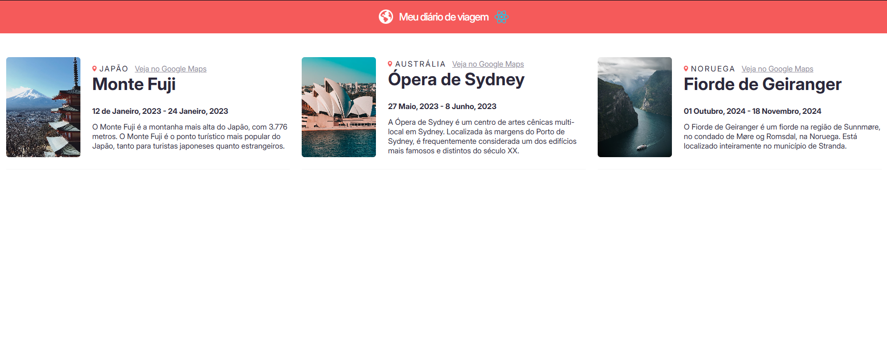

<h1>Meu diário de viagens - versão React</h1>

Este projeto consiste em um diário de viagem que cria artigos de acordo com a quantidade de objetos no arquito <code>database</code> utilizando a biblioteca React na criação do site.

<h2>Objetivo</h2>

O objetivo deste projeto é criar uma versão de outro projeto que fiz, mas agora usando a biblioteca React

É possível notar uma grande diferença ao usar a biblioteca, principalmente na geração de elementos HTML.

A criação de cada elemento não necessita do uso da interface <code>document</code>, pois o React cuida desse trabalho.

As diferenças ao fazer essa versão do mesmo projeto são muito notáveis, a biblioteca React é muito fascinante.

<h2>Como funciona?</h2>
<ul>
    <li>
A criação dos artigos é feita através do componente <code>Article</code>;
</li>
    <li>
Esse componente retorna uma estrutura jsx de um <code>article</code>, adicionando todas as informações que recebe em sua propriedade.
</li>
</ul>

Dessa forma, sempre que um novo dado é adicionado à "base de dados", um novo artigo é criado automáticamente.

Além das mudanças na lógica do código, realizei alterações na folha de estilos e atualizei o atributo <code>image</code>, que agora também é um objeto que possui uma <code>src</code> e um<code>alt</code>

<h2>Site no computador</h2>
 
<h2>Site no celular</h2>
 